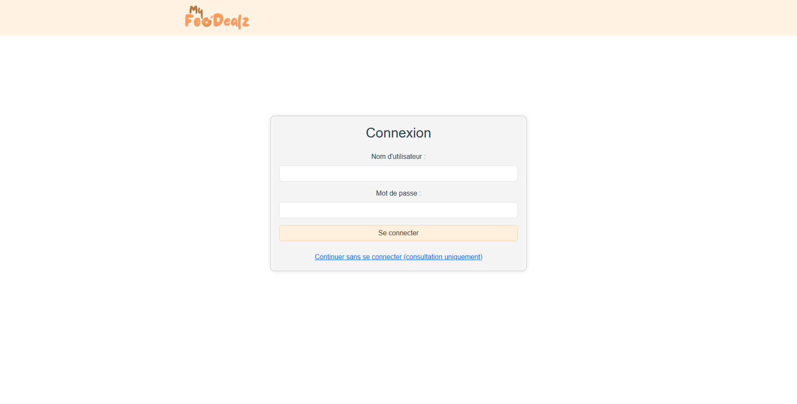

# My Foo'Dealz

Application dédiée aux offres spéciales, aux promotions du jour et aux réductions. Les utilisateurs peuvent consulter les offres en cours et des nouvelles promotions sur un feed.

## Table des Matières
1. [Aperçu](#aperçu)
2. [Fonctionnalités](#fonctionnalités)
3. [Captures d'écran](#captures-décran)
4. [Installation](#installation)
5. [Utilisation](#utilisation)
6. [Contribuer](#contribuer)
7. [Licence](#licence)

## Aperçu
Login page : 

Feed avec les promotions :

Ajouter une promotion : 

## Fonctionnalités
Possibilité de consulter uniquement les promotions sans ajouter ni modifier.
Possibilité de se connecter avec username : 'admin', password : 'admin' pour modifier, supprimer et ajouter des promotions.

## Installation
Il suffit de npm install toutes les dependances pour chaque partie de l'application.

## Utilisation
"npm run start:dev" pour le back-end
"vue serve" pour le back-end

## Licence
My Foo'Dealz, projet d'école signé MAKIL Marouan
